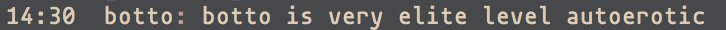

# Botto

A very advanced robot



# Usage

1. Clone this repo

2. `cd botto` then `npm install --no-optional`

3. Edit `config.js` according to `example.config.js` in the root directory

4. Seed the database with [seed.sql](db/seed.sql), or comment out any modules you do not want (note: you can also !unmount them while botto is running)

5. Launch your botto with `node botto.js`

# Design

Botto uses 2 types of listeners when responding to events: commands and observers.
the `_commandHandler` and `_observerHandler` both act as routing layers to call
their respective modules. The modules themselves contain the logic for whatever the
module is responsible for. This allows us to easily add/remove/hot-swap modules
without having to mess with the routing layer since the modules are pulled in
dynamically on message events.

Both [commands](./commands/command.js) & [observers](./observers/observer.js) inherit from their parent class. Child modules will do whatever
work they need to, and ultimately return a `respond()` callback with their response. This 
callback will respond with the supplied value to the designated receiver as determined by 
the `_*Handler` (be it a channel, private message, etc). For an better understanding, check 
out the [observerHandler class](./observers/_observerHandler.js).

### Commands
Commands are explicit commands that start with the !bang syntax and are all listed
under the [commands](./commands) directory. Commands must follow the convention of
module name == command name. In other words, if your command trigger is
`!foo [args]`, your command module must be named `foo.js`. Every command must extend
the [base command](./commands/command.js) class.

**Note**: By convention, all commands must declare a call function like so:

```
call(bot, opts, respond) {
 // some code
}
```

Where `opts` is the options hash created in the handler and `respond` is a callback
to be fired with the string you wish the bot to echo to the receiver. The `bot` instance
itself is passed for use in [admin](./commands/admin/) commands and ignored otherwise. This `call`
function should be used to parse the incoming message and delegate to the appropriate
helper functions.

### Admin Commands
[Admin commands](./commands/admin/) act as normal !bang prefixed commands, but only respond to 
users who are declared as global or channel-specific admins in `config.js`. 

### Observers
Observers are triggered when an observable event happens (a keyword or nickname is
mentioned, for example). Each observer instance must declare a matching `RegEx` in its
constructor which it will trigger upon matching incoming message events. Each observer must
extend the [base observer](./observers/observer.js) class. Like commands, each observer 
must also declare a call function:

```
call(opts, respond) {
 // some code
}
```

If you need an observer to fire on every message event, for example building a cache of 
all recent messages, you should use a regex that captures any message sent: `/.*/`

### DB Schema
Enter psql prompt with `psql -d botto`.

Import the schema (from psql) with `\i db/schema.sql`. Old tables will be skipped.
